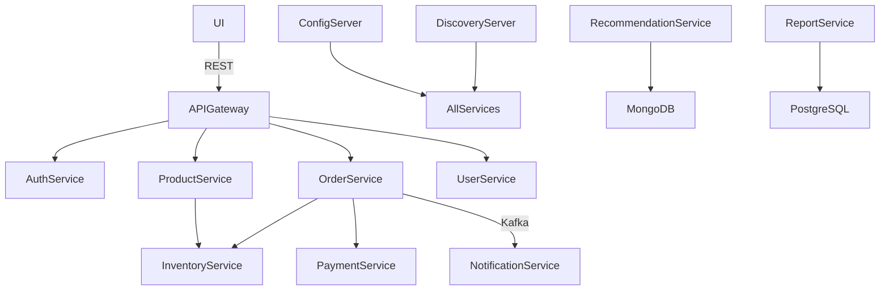

# 🛍️ E-Commerce Microservices Project (Spring Boot + Docker + K8s)


---

## 📘 Project Overview

A **production-grade e-commerce backend** built with **Spring Boot** and **microservices architecture**, featuring:

- Independent scalable services  
- OAuth2.0 + JWT security  
- Dockerized deployment with Kubernetes  
- Kafka-based async communication  
- AI product recommendations  
- CI/CD pipeline with Jenkins  

---

## 🎯 Objectives

✅ Modularize backend logic with Spring Boot microservices  
Use Spring Cloud for config, discovery, and gateway  
Implement secure user authentication (OAuth2.0 + JWT)  
Enable Kafka-based event communication  
Monitor with Prometheus & Grafana  
Containerize and deploy with Docker & Kubernetes  
Automate builds and deployments using Jenkins  

---

## ⚙️ Tech Stack

| Layer             | Technology                        |
|------------------|-----------------------------------|
| Backend          | Java 17, Spring Boot 3.x          |
| API Gateway      | Spring Cloud Gateway              |
| Service Registry | Eureka                            |
| Config Server    | Spring Cloud Config               |
| Auth             | Spring Authorization Server, JWT |
| Database         | PostgreSQL, MongoDB               |
| Messaging        | Kafka + Zookeeper                 |
| Monitoring       | Prometheus + Grafana              |
| Logging          | Log4j2                            |
| CI/CD            | Jenkins                           |
| Orchestration    | Docker, Kubernetes (Minikube)     |

---

## 🧱 Microservices Architecture



---

## 📊 Project Roadmap & Phases

| Phase | Goal                    | Key Services                   | Status |
|-------|-------------------------|--------------------------------|--------|
| 0     | Infrastructure Setup    | -                              | ✅ Done |
| 1     | Project Bootstrapping   | commonlib, config, gateway     |        |
| 2     | Core Infra Services     | config, discovery, gateway     |  |
| 3     | Auth & Security         | auth, user                     |  |
| 4     | Product & Inventory     | product, inventory             |  |
| 5     | Orders & Payments       | order, payment, address        |  |
| 6     | Async with Kafka        | notification                   |  |
| 7     | Monitoring & Logging    | logging, Prometheus, Grafana   |  |
| 8     | AI Recommendations      | recommendation                 |  |
| 9     | Reporting & Analytics   | report                         |  |
| 10    | Docker & Kubernetes     | all services                   |  |
| 11    | API Docs & Postman      | swagger, postman               |  |

---

## 🔐 Authentication & Security

- ✅ OAuth2.0 via Spring Authorization Server  
- ✅ JWT access + refresh tokens  
- ✅ BCrypt password hashing  
- ✅ Role-based access (`ROLE_USER`, `ROLE_ADMIN`)  
- ✅ Secure endpoints via API Gateway  

---

## 📡 Kafka-Based Async Communication

- `OrderService` → Kafka Topic: `order-events`  
- `NotificationService` consumes order events  
- Retry and Dead Letter Topics configured  
- Embedded Kafka tests + Docker Kafka setup  

---

## 📈 Observability

| Tool         | Purpose                    |
|--------------|----------------------------|
| Spring Actuator | Service health & metrics |
| Prometheus      | Metrics scraping         |
| Grafana         | Dashboards (JVM, API)    |
| Log4j2          | JSON logs w/ traceId     |

---

## 🗃️ Directory Structure

```
ecom-microservices/
├── apigateway/
├── authservice/
├── configserver/
├── discoveryserver/
├── userservice/
├── productservice/
├── inventoryservice/
├── orderservice/
├── paymentservice/
├── addressservice/
├── notificationservice/
├── loggingservice/
├── recommendationservice/
├── reportservice/
├── commonlib/
├── k8s/                  # Kubernetes manifests
└── docker-compose.yaml   # Local stack (WIP)
```

---

## 🛠️ Local Setup

### 🔧 Prerequisites

- JDK 17+  
- Maven 3.8+  
- Docker Desktop  
- PostgreSQL + pgAdmin  
- Kafka + Zookeeper (via Docker)  
- MongoDB Compass  
- Redis (optional)  
- Jenkins (port 9090)  
- Minikube + kubectl  
- IntelliJ IDEA / VS Code  

---

### 🏁 Run Services Locally

```bash
# Clone the project
git clone https://github.com/sachin-kumar-09/ecom-microservices.git
cd ecom-microservices

# Build shared library
cd commonlib && mvn clean install

# Start each service
cd ../configserver && mvn spring-boot:run
cd ../discoveryserver && mvn spring-boot:run
cd ../apigateway && mvn spring-boot:run
...
```

#### Or run using Docker Compose (if available)

```bash
docker-compose up --build
```

---

## ☸️ Kubernetes Deployment

```bash
# Start Minikube
minikube start

# Apply K8s manifests
kubectl apply -f k8s/

# Monitor status
kubectl get pods
```

---

## 🧪 Testing Strategy

- Unit Tests: JUnit 5, Mockito  
- Integration: PostgreSQL, Kafka (TestContainers)  
- E2E Tests: Order → Payment → Notification  
- Security Tests: AuthService endpoints  
- Postman: Collections grouped by service  

---

## 🧾 API Documentation

- Swagger UI for each service:  
  `http://localhost:<port>/swagger-ui.html`  
- Exported OpenAPI JSON per service  
- Postman collection available in `/postman` folder (WIP)  

---

## 🔄 CI/CD with Jenkins

### Jenkins pipeline steps:

- Pull source code  
- Maven build + test  
- Docker image build  
- Push to DockerHub  
- Deploy to Kubernetes via `kubectl`  
- Jenkins hosted on port 9090  
- Triggers on push to `main` or `dev`  

---

## 🤝 Contributing

We welcome your contributions!

```bash
# Fork it
git clone https://github.com/your-username/ecom-microservices.git

# Create your branch
git checkout -b feature/my-feature

# Commit changes
git commit -m "Add my feature"

# Push and create a PR
git push origin feature/my-feature
```

---

## 🔗 Repository

👉 [View on GitHub](https://github.com/sachin-kumar-09/ecom-microservices)

---

## 📄 License

MIT License — Free to use, modify and distribute.

---